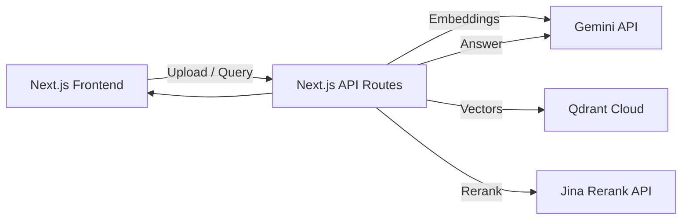

# Mini RAG (Qdrant + Gemini)

Small production-minded RAG app with file upload/paste ingestion, Qdrant vector storage, reranking, and Gemini-based answering with inline citations.

## Architecture



## Providers

- **LLM & Embeddings:** Gemini (`gemini-1.5-flash-latest`, `text-embedding-004`)
- **Vector DB:** Qdrant Cloud (free tier)
- **Reranker:** Jina Rerank API (free tier)
- **Hosting:** Vercel or Render

## Index Configuration

- **Collection name:** `rag_chunks`
- **Vector size:** 768 (Gemini `text-embedding-004`)
- **Distance:** Cosine
- **Upsert strategy:** batch size 64, dedupe by SHA-256 hash
- **Metadata:** `source`, `title`, `section`, `position`, `hash`

## Chunking Strategy

- **Chunk size:** 1000 tokens
- **Overlap:** 120 tokens (~12%)
- **Method:** sentence-aware packing with overlap

## Retrieval & Reranking

- **Retriever:** Qdrant top-k (default 50) + MMR re-selection (default 20, λ=0.7)
- **Reranker:** Jina Rerank (default top 8)
- **No-answer:** If top rerank score < 0.15, return "I do not know..."

## API Endpoints

- `POST /api/ingest` — ingest text
- `POST /api/ingest-file` — ingest PDF files
- `POST /api/query` — answer with citations

## Environment

Create `.env.local` (local dev) or set in hosting dashboard:

```
GEMINI_API_KEY=...
GEMINI_CHAT_MODEL=gemini-2.5-flash
GEMINI_EMBED_MODEL=text-embedding-004
GEMINI_MAX_OUTPUT_TOKENS=2048

QDRANT_URL=https://YOUR-CLUSTER-URL
QDRANT_API_KEY=YOUR_QDRANT_KEY
QDRANT_COLLECTION=rag_chunks

JINA_API_KEY=YOUR_JINA_KEY
RERANK_MODEL=jina-reranker-v3
RERANK_TOP_N=8

CHUNK_TOKENS=1000
CHUNK_OVERLAP_TOKENS=120
RETRIEVE_TOP_K=50
MMR_TOP_K=20
MMR_LAMBDA=0.7
MIN_RERANK_SCORE=0.15
UPSERT_BATCH=64

COST_PER_1K_INPUT=0
COST_PER_1K_OUTPUT=0
```

## Deployment to Netlify

1. Push to GitHub
2. Connect repo to Netlify
3. Add environment variables above in Netlify dashboard
4. Deploy automatically uses `netlify.toml` settings

## Quick Start

```bash
npm install
npm run dev
```

Open http://localhost:3000

## Gold Set (Minimal Eval)

See [data/gold.json](data/gold.json) for 5 Q/A pairs. Evaluate precision/recall by checking whether the cited sources match the expected sources.

## Remarks

- Qdrant free tier limits storage/throughput; large corpora will require paid tiers.
- Reranker requires a separate API key (Jina free tier). If missing, reranking is skipped.
- Chunking and token counts are approximations; for high fidelity, replace with a true tokenizer.

## Hosting

- **Vercel:** deploy the Next.js app directly.
- **Render:** use a Node service + static site if desired.

## Resume

(Add resume link here)
