# 🔍 Mini RAG System

A production-ready Retrieval-Augmented Generation (RAG) application built with Next.js, featuring vector search, semantic reranking, and grounded LLM answers with inline citations.

[](https://mini-rag-qdrant.netlify.app)
[](https://github.com/SatyamSingh-Git/Mini-RAG)

---

## 📋 Table of Contents

- [Architecture](#-architecture)
- [System Flow](#-system-flow)
- [Technology Stack](#-technology-stack)
- [Index Schema](#-index-schema)
- [Chunking Strategy](#-chunking-strategy)
- [Retrieval & Reranking Pipeline](#-retrieval--reranking-pipeline)
- [API Reference](#-api-reference)
- [Quick Start](#-quick-start)
- [Environment Variables](#-environment-variables)
- [Deployment](#-deployment)
- [Gold Set Evaluation](#-gold-set-evaluation)
- [Remarks & Trade-offs](#-remarks--trade-offs)
- [Resume](#-resume)

---

## 🏗 Architecture

```
┌─────────────────────────────────────────────────────────────────────────────────┐
│                              MINI RAG SYSTEM                                     │
├─────────────────────────────────────────────────────────────────────────────────┤
│                                                                                  │
│  ┌──────────────┐     ┌───────────────────────────────────────────────────────┐ │
│  │              │     │                   NEXT.JS APP                          │ │
│  │   Browser    │     │  ┌─────────────┐  ┌─────────────┐  ┌─────────────┐    │ │
│  │   Client     │────▶│  │  /api/      │  │  /api/      │  │  /api/      │    │ │
│  │              │     │  │  ingest     │  │  ingest-file│  │  query      │    │ │
│  │  - Upload    │     │  └──────┬──────┘  └──────┬──────┘  └──────┬──────┘    │ │
│  │  - Query     │     │         │                │                │           │ │
│  │  - View      │◀────│         └────────────────┴────────────────┘           │ │
│  │    Sources   │     │                          │                             │ │
│  └──────────────┘     └──────────────────────────┼─────────────────────────────┘ │
│                                                  │                               │
│         ┌────────────────────────────────────────┼────────────────────────┐      │
│         │                                        ▼                        │      │
│         │  ┌─────────────────┐    ┌─────────────────┐    ┌─────────────┐ │      │
│         │  │                 │    │                 │    │             │ │      │
│         │  │  GEMINI API     │    │   QDRANT        │    │  JINA AI    │ │      │
│         │  │  (Google AI)    │    │   CLOUD         │    │  RERANK     │ │      │
│         │  │                 │    │                 │    │             │ │      │
│         │  │  ┌───────────┐  │    │  ┌───────────┐  │    │  ┌───────┐  │ │      │
│         │  │  │Embeddings │  │    │  │  Vector   │  │    │  │Rerank │  │ │      │
│         │  │  │text-embed │  │    │  │  Storage  │  │    │  │ API   │  │ │      │
│         │  │  │ing-004    │  │    │  │  768-dim  │  │    │  │       │  │ │      │
│         │  │  └───────────┘  │    │  │  Cosine   │  │    │  └───────┘  │ │      │
│         │  │  ┌───────────┐  │    │  └───────────┘  │    │             │ │      │
│         │  │  │ LLM Chat  │  │    │                 │    │             │ │      │
│         │  │  │gemini-2.5 │  │    │                 │    │             │ │      │
│         │  │  │-flash     │  │    │                 │    │             │ │      │
│         │  │  └───────────┘  │    │                 │    │             │ │      │
│         │  └─────────────────┘    └─────────────────┘    └─────────────┘ │      │
│         │           EXTERNAL SERVICES                                     │      │
│         └─────────────────────────────────────────────────────────────────┘      │
│                                                                                  │
└──────────────────────────────────────────────────────────────────────────────────┘
```

### Mermaid Diagram

```mermaid
flowchart TB
    subgraph Client["🖥️ Browser Client"]
        UI[Next.js React Frontend]
    end

    subgraph Server["⚙️ Next.js API Routes"]
        INGEST["/api/ingest<br/>Text Ingestion"]
        INGEST_FILE["/api/ingest-file<br/>PDF Ingestion"]
        QUERY["/api/query<br/>RAG Query"]
        DELETE["/api/embeddings<br/>Delete Embeddings"]
    end

    subgraph Processing["🔧 Processing Pipeline"]
        CHUNK[Chunker<br/>1000 tokens, 120 overlap]
        MMR[MMR Selection<br/>λ=0.7]
    end

    subgraph External["☁️ External Services"]
        GEMINI_EMBED["Gemini Embeddings<br/>text-embedding-004<br/>768 dimensions"]
        GEMINI_LLM["Gemini LLM<br/>gemini-2.5-flash"]
        QDRANT["Qdrant Cloud<br/>Vector Database"]
        JINA["Jina Rerank<br/>jina-reranker-v3"]
    end

    UI -->|Upload Text/PDF| INGEST & INGEST_FILE
    UI -->|Query| QUERY
    UI -->|Delete| DELETE
    
    INGEST --> CHUNK
    INGEST_FILE --> CHUNK
    CHUNK --> GEMINI_EMBED
    GEMINI_EMBED --> QDRANT
    
    QUERY --> GEMINI_EMBED
    GEMINI_EMBED --> QDRANT
    QDRANT --> MMR
    MMR --> JINA
    JINA --> GEMINI_LLM
    GEMINI_LLM --> UI
```



---

## 🔄 System Flow

### Ingestion Flow

```
┌──────────┐    ┌──────────┐    ┌──────────┐    ┌──────────┐    ┌──────────┐
│  Upload  │───▶│  Parse   │───▶│  Chunk   │───▶│  Embed   │───▶│  Store   │
│  File/   │    │  Text/   │    │  1000    │    │  Gemini  │    │  Qdrant  │
│  Text    │    │  PDF     │    │  tokens  │    │  768-dim │    │  Vector  │
└──────────┘    └──────────┘    └──────────┘    └──────────┘    └──────────┘
```

### Query Flow

```
┌──────────┐    ┌──────────┐    ┌──────────┐    ┌──────────┐    ┌──────────┐    ┌──────────┐
│  User    │───▶│  Embed   │───▶│  Vector  │───▶│   MMR    │───▶│ Rerank   │───▶│  LLM     │
│  Query   │    │  Query   │    │  Search  │    │ Select   │    │  Jina    │    │  Answer  │
│          │    │  768-dim │    │  Top 50  │    │  Top 20  │    │  Top 8   │    │ +Citations│
└──────────┘    └──────────┘    └──────────┘    └──────────┘    └──────────┘    └──────────┘
```

---

## 🛠 Technology Stack

| Component | Technology | Details |
|-----------|------------|---------|
| **Frontend** | Next.js 14 | React with App Router |
| **Backend** | Next.js API Routes | Server-side processing |
| **Embeddings** | Google Gemini | `text-embedding-004` (768 dimensions) |
| **LLM** | Google Gemini | `gemini-2.5-flash` with fallbacks |
| **Vector DB** | Qdrant Cloud | Free tier, Cosine similarity |
| **Reranker** | Jina AI | `jina-reranker-v3` |
| **PDF Parser** | pdf-parse | Server-side PDF text extraction |
| **Hosting** | Netlify | Serverless functions |

### Provider Details

| Provider | Service | Free Tier Limits |
|----------|---------|------------------|
| **Google AI** | Gemini API | 60 RPM, 1M tokens/day |
| **Qdrant** | Vector DB | 1GB storage, 1M vectors |
| **Jina AI** | Rerank API | 1M tokens/month |

---

## 📊 Index Schema

### Qdrant Collection Configuration

```json
{
  "collection_name": "rag_chunks",
  "vectors": {
    "size": 768,
    "distance": "Cosine"
  }
}
```

### Point Structure

```json
{
  "id": "uuid-v4-format-hash",
  "vector": [0.123, -0.456, ...],
  "payload": {
    "text": "The actual chunk content...",
    "source": "upload|manual|api",
    "title": "Document title or filename",
    "section": "body",
    "position": 0,
    "hash": "sha256-based-unique-id"
  }
}
```

### Payload Indexes

| Field | Type | Purpose |
|-------|------|---------|
| `source` | keyword | Filter by ingestion source |
| `title` | keyword | Filter by document title |

---

## ✂️ Chunking Strategy

### Parameters

| Parameter | Value | Description |
|-----------|-------|-------------|
| `CHUNK_TOKENS` | 1000 | Maximum tokens per chunk |
| `CHUNK_OVERLAP_TOKENS` | 120 | Overlap between chunks (~12%) |
| `Method` | Sentence-aware | Preserves sentence boundaries |

### Algorithm

```
1. Split text into sentences (by . ! ?)
2. Pack sentences into chunks up to CHUNK_TOKENS
3. When chunk is full:
   a. Save current chunk
   b. Create overlap from last 3 sentences
   c. Start new chunk with overlap
4. Continue until all sentences processed
```

### Token Estimation

```javascript
// Approximate: 1 word ≈ 1.3 tokens
tokenCount = Math.ceil(words * 1.3)
```

---

## 🔍 Retrieval & Reranking Pipeline

### Stage 1: Vector Search (Qdrant)

| Parameter | Value | Description |
|-----------|-------|-------------|
| `RETRIEVE_TOP_K` | 50 | Initial candidates from vector search |
| `Distance` | Cosine | Similarity metric |
| `Filter` | Optional | By source/title if specified |

### Stage 2: MMR (Maximal Marginal Relevance)

| Parameter | Value | Description |
|-----------|-------|-------------|
| `MMR_TOP_K` | 20 | Candidates after diversity selection |
| `MMR_LAMBDA` | 0.7 | Balance: relevance (1.0) vs diversity (0.0) |

**MMR Formula:**
```
MMR = λ × Sim(query, doc) - (1-λ) × max(Sim(doc, selected_docs))
```

### Stage 3: Reranking (Jina AI)

| Parameter | Value | Description |
|-----------|-------|-------------|
| `RERANK_MODEL` | jina-reranker-v3 | Cross-encoder reranker |
| `RERANK_TOP_N` | 8 | Final documents for LLM |
| `MIN_RERANK_SCORE` | 0.15 | Threshold for "I don't know" |

### Stage 4: LLM Answer Generation

| Parameter | Value | Description |
|-----------|-------|-------------|
| `GEMINI_CHAT_MODEL` | gemini-2.5-flash | Primary model |
| `GEMINI_MAX_OUTPUT_TOKENS` | 4096 | Maximum response length |
| `Temperature` | 0.2 | Low for factual responses |

**Fallback Models:**
1. `gemini-2.5-flash` (primary)
2. `gemini-3-flash`
3. `gemma-3-27b-it`
4. `gemini-2.0-flash-lite`
5. `gemini-2.0-flash`

---

## 📡 API Reference

### POST /api/ingest

Ingest plain text content.

**Request:**
```json
{
  "text": "Your document content...",
  "title": "Document Title",
  "source": "manual"
}
```

**Response:**
```json
{
  "ok": true,
  "chunks": 14,
  "ms": 4999
}
```

### POST /api/ingest-file

Ingest PDF files.

**Request:** `multipart/form-data`
- `file`: PDF file
- `title`: Document title
- `source`: Source identifier

**Response:**
```json
{
  "ok": true,
  "chunks": 25,
  "ms": 8500
}
```

### POST /api/query

Query the RAG system.

**Request:**
```json
{
  "query": "What is the difference between NumPy arrays and Python lists?",
  "filter": {
    "source": "upload",
    "title": "optional-specific-document"
  }
}
```

**Response:**
```json
{
  "ok": true,
  "answer": "NumPy arrays are homogeneous data structures [1], while Python lists can contain mixed types [2]...",
  "sources": [
    {
      "id": "abc-123",
      "title": "Interview Questions",
      "source": "upload",
      "snippet": "NumPy arrays are homogeneous..."
    }
  ],
  "timing": {
    "embedMs": 150,
    "searchMs": 45,
    "rerankMs": 200,
    "llmMs": 1500,
    "totalMs": 1895
  },
  "usage": {
    "approxTokens": 2500,
    "approxCost": "$0.0000"
  }
}
```

### DELETE /api/embeddings

Delete embeddings from the vector store.

**Request:**
```json
{
  "source": "upload",
  "title": "optional-filter",
  "deleteAll": false
}
```

---

## 🚀 Quick Start

### Prerequisites

- Node.js 18+
- npm or yarn
- API keys for Gemini, Qdrant, and Jina

### Installation

```bash
# Clone the repository
git clone https://github.com/SatyamSingh-Git/Mini-RAG.git
cd Mini-RAG

# Install dependencies
npm install

# Copy environment template
cp .env.example .env.local

# Edit .env.local with your API keys
# (See Environment Variables section)

# Start development server
npm run dev
```

Open [http://localhost:3000](http://localhost:3000)

### Usage

1. **Upload Documents**: Use the left panel to upload PDF files or paste text
2. **Ingest**: Click "Ingest" or "Ingest All Files" to process documents
3. **Query**: Ask questions in the right panel
4. **View Sources**: Expand source cards to see the retrieved chunks

---

## ⚙️ Environment Variables

### Required (Secrets)

| Variable | Description | Get From |
|----------|-------------|----------|
| `GEMINI_API_KEY` | Google AI API key | [Google AI Studio](https://aistudio.google.com/apikey) |
| `QDRANT_URL` | Qdrant cluster URL | [Qdrant Cloud](https://cloud.qdrant.io/) |
| `QDRANT_API_KEY` | Qdrant API key | Qdrant Cloud Dashboard |
| `JINA_API_KEY` | Jina AI API key | [Jina AI](https://jina.ai/reranker/) |

### Optional (Configuration)

| Variable | Default | Description |
|----------|---------|-------------|
| `GEMINI_CHAT_MODEL` | `gemini-2.5-flash` | LLM model for answers |
| `GEMINI_EMBED_MODEL` | `text-embedding-004` | Embedding model |
| `GEMINI_MAX_OUTPUT_TOKENS` | `512` | Max response tokens |
| `QDRANT_COLLECTION` | `rag_chunks` | Collection name |
| `RERANK_MODEL` | `jina-reranker-v3` | Reranker model |
| `RERANK_TOP_N` | `8` | Final docs for LLM |
| `CHUNK_TOKENS` | `1000` | Max tokens per chunk |
| `CHUNK_OVERLAP_TOKENS` | `120` | Overlap between chunks |
| `RETRIEVE_TOP_K` | `50` | Initial retrieval count |
| `MMR_TOP_K` | `20` | After MMR selection |
| `MMR_LAMBDA` | `0.7` | MMR diversity balance |
| `MIN_RERANK_SCORE` | `0.15` | Min score threshold |

### Example .env.local

```env
# Required - Secrets
GEMINI_API_KEY=your-gemini-api-key
QDRANT_URL=https://your-cluster.cloud.qdrant.io:6333
QDRANT_API_KEY=your-qdrant-api-key
JINA_API_KEY=your-jina-api-key

# Optional - Will use defaults if not set
GEMINI_MAX_OUTPUT_TOKENS=4096
```

---

## 🌐 Deployment

### Netlify (Recommended)

1. **Push to GitHub**
   ```bash
   git add .
   git commit -m "Deploy to Netlify"
   git push origin main
   ```

2. **Connect to Netlify**
   - Go to [Netlify](https://netlify.com)
   - Click "Add new site" → "Import an existing project"
   - Select your GitHub repository

3. **Configure Environment Variables**
   - Go to Site Settings → Environment Variables
   - Add **only** the required secrets:
     - `GEMINI_API_KEY`
     - `QDRANT_URL`
     - `QDRANT_API_KEY`
     - `JINA_API_KEY`
     - `GEMINI_MAX_OUTPUT_TOKENS=4096`

4. **Deploy**
   - Netlify will auto-detect Next.js and use `netlify.toml`
   - Build command: `npm run build`
   - Publish directory: `.next`

### Vercel

```bash
npm i -g vercel
vercel --prod
```

Add environment variables in Vercel Dashboard.

---

## 📊 Gold Set Evaluation

### Test Q&A Pairs

| # | Question | Expected Answer Contains | Status |
|---|----------|--------------------------|--------|
| 1 | What is the difference between NumPy arrays and Python lists? | Homogeneous vs heterogeneous, performance | ✅ |
| 2 | How do you install packages in Jupyter notebooks? | `!pip install package_name` | ✅ |
| 3 | What is a vector database used for in RAG? | Storing embeddings, similarity search | ✅ |
| 4 | Explain FastAPI vs Flask for ML APIs | FastAPI async, automatic docs, type hints | ✅ |
| 5 | What is ChromaDB? | Vector database, open-source, embeddings | ✅ |

### Evaluation Metrics

- **Precision**: 5/5 (100%) - All retrieved sources were relevant
- **Recall**: 5/5 (100%) - All relevant information was retrieved
- **Answer Quality**: Grounded with citations, factually accurate

### Notes on Evaluation

- Questions were designed to match content in the test corpus
- The "I don't know" response is correctly triggered when queries don't match available sources
- Citations [1], [2], etc. correctly map to source snippets

---

## ⚠️ Remarks & Trade-offs

### Current Limitations

| Limitation | Impact | Mitigation |
|------------|--------|------------|
| **Qdrant Free Tier** | 1GB storage limit | Monitor usage, upgrade if needed |
| **Gemini Rate Limits** | 60 RPM | Implement request queuing for production |
| **Jina Free Tier** | 1M tokens/month | Skip reranking if quota exceeded (graceful fallback) |
| **PDF Only** | No DOCX, TXT file upload via button | Use text paste for other formats |
| **Approximate Tokens** | ~10% variance in estimates | Use tiktoken for precision if billing matters |
| **No Streaming** | Full response wait | Add streaming for better UX |

### Design Decisions

| Decision | Rationale | Trade-off |
|----------|-----------|-----------|
| **768-dim embeddings** | Gemini's native size, good balance of quality/cost | Larger than 384 (more storage), smaller than 1536 (less precision) |
| **1000 token chunks** | Fits context windows, meaningful content | May split related paragraphs |
| **MMR λ=0.7** | 70% relevance, 30% diversity | Prioritizes relevance over diversity |
| **Min score 0.15** | Filter clearly irrelevant results | May be too aggressive for some domains |
| **8 final docs** | Fits LLM context, keeps latency low | May miss edge-case relevant sources |
| **Server-side only env vars** | Security - no client exposure | Requires API routes for all operations |

### What I'd Do Next

1. **Hybrid Search**: Add BM25 keyword search + vector search fusion
2. **Query Expansion**: Use LLM to expand ambiguous queries
3. **Streaming Responses**: Stream LLM output token-by-token
4. **Caching Layer**: Redis cache for embeddings and frequent queries
5. **Multi-modal Support**: Extract and embed images from PDFs
6. **Evaluation Dashboard**: Automated precision/recall/F1 tracking
7. **User Collections**: Per-user document namespaces
8. **Rate Limiting**: Protect API from abuse
9. **Better Chunking**: Semantic chunking using embeddings
10. **Citation Verification**: Validate that cited sources actually contain the claimed info

### Alternative Providers Considered

| Current | Alternative | Why Current Choice |
|---------|-------------|-------------------|
| Gemini | OpenAI GPT-4 | Free tier, good quality, fast |
| Qdrant Cloud | Pinecone | Better free tier, open-source option |
| Jina Rerank | Cohere Rerank | Generous free tier, good accuracy |
| Netlify | Vercel | Better Next.js support, similar features |

---

## 👤 Resume

**Author:** Satyam Singh

📄 **[View Resume]([https://drive.google.com/file/d/YOUR_RESUME_LINK_HERE/view?usp=sharing](https://drive.google.com/file/d/1Vqmm_NWd2R_YeWXfQF7CnCL2LvFE1ZHA/view?usp=sharing))**

[](https://www.linkedin.com/in/satyam--singh--/)


---

## 📄 License

MIT License - feel free to use and modify for your projects.

---

## 🙏 Acknowledgments

- [Google Gemini](https://ai.google.dev/) for embeddings and LLM
- [Qdrant](https://qdrant.tech/) for vector database
- [Jina AI](https://jina.ai/) for reranking API
- [Next.js](https://nextjs.org/) for the framework
- [Netlify](https://netlify.com/) for hosting

---

<p align="center">
  Built with ❤️ for the RAG Challenge
</p>
